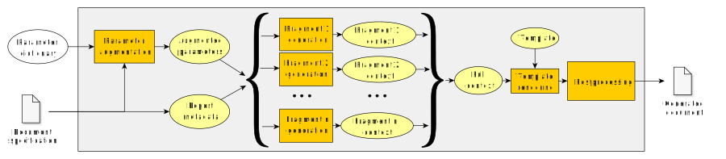
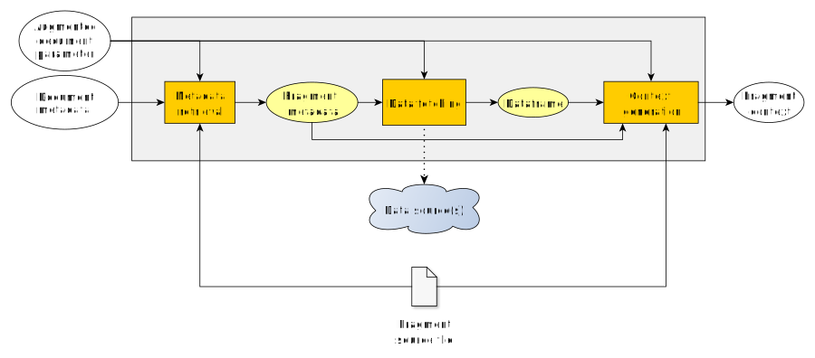

Report Compiler
###############

|docs|

The Report Compiler is a python library that uses a JSON specification and custom code to compile highly parameterizable and reusable documents. This specification, along document parameters represented by a dictionary, is processed by a pipeline to generate highly customizable content. The pipeline stages are designed as plugin modules, making it very easy to extend for particular needs.

This library is currently under heavy development so at this time the architecture might change at any time until considered sufficiently mature. It will not be ready for production until significant, real-world usage shows shortcomings/limitations to be considered for potential architecture redesign. Therefore, at this time, the API(particularly the JSON specification) can change between versions.

This library is being developed by the ICO/IARC Information Centre on HPV and Cancer and will be used in our internal report generation tasks.

.. image:: img/HPV_infocentre.png
   :height: 50px
   :align: center
   :target: http://www.hpvcentre.net

.. |docs| image:: https://readthedocs.org/projects/reportcompiler/badge/?version=doc
    :alt: Documentation Status
    :scale: 100%
    :target: https://reportcompiler.readthedocs.io/en/doc/?badge=doc

Features
============

* Adaptable parameterized document generation from a variety of data sources, programming languages and processing stages.
* Complete customization via plugins for each stage.
* Use of template libraries to separate logic from presentation.
* Division of documents in independent fragments.
* Parallelizable generation at document and fragment level.

Workflow
========

Here is a brief summary of the document generation process. For more detail, please consult the documentation.

Document specification
----------------------

To define how a document will be generated a document specification has to be created. This specification is a directory with the necessary information to generate documents; it includes templates, source files, configuration files or data files among others. The content of the generated documents can be split up and defined in **fragments**, each having a corresponding template (describing its visualization) and source file (describing its processed data).

These directory structures fully represent a document generation workflow and they can be easily moved, extended or distributed without any unnecessary dependencies. Furthermore, a file structure is a code-friendly environment, being able to seamlessly debug or use version control like any other software project, for example.

Document generation
-------------------

Once a document specification is made, a document can be generated: first, a document parameter is provided as a dictionary. This parameter is augmented with additional information if necessary and, along with the document metadata, each fragment's context is generated (see below). These fragments are merged into a full context that is used to render the templates (using one of the available template rendering plugins) to create the document. Optionally, some postprocessing plugins can be applied to the document.

Fragment generation
-------------------

Each fragment follows a three-step process. First, the fragment source file is inspected (using source parser plugins) for possible metadata to be added or overriden into the document metadata. Then, this metadata and the document parameter is used to fetch the required data from one of the available sources implemented via plugins. Finally, this data along with the document parameter and the metadata is used to generate a dictionary that will be returned as the context to fill the corresponding template in the template rendering stage (see above).

Dependencies
============

Report Compiler has a set of common dependencies specified in the setup script (setup.py) that should
be installed automatically with the install_package.sh script.

Additionally, the different plugins might have additional dependencies not included in the main package 
to avoid unnecessary libraries installed for unused plugins.

Installation
============

Package
-------

.. code:: bash

 git clone https://github.com/hpv-information-centre/reportcompiler
 cd reportcompiler/scripts
 ./install_package.sh
 
Document generation example
---------------------------

.. code:: python

 >>> from reportcompiler.documents import DocumentSpecification

 >>> root_reports_path = '/home/user/reports'
 >>> repo_url = 'https://github.com/hpv-information-centre/reportcompiler-examples'
 >>> report = DocumentSpecification(root_reports_path,
 >>>                                repo_url=repo_url,
 >>>                                repo_relative_path='example-music')
 >>> report.generate({'artist_id': 1})

For this example you will need:

* `R environment`_ to generate context for R source files.
* LaTeX environment such as MikTeX_ to compile to a PDF document.

For more examples of documents ready to be compiled by this library please check here_.

.. _`R environment`: https://www.r-project.org/
.. _MikTeX: https://miktex.org/
.. _here: https://github.com/hpv-information-centre/reportcompiler-examples

Documentation
-------------

To generate HTML documentation:

.. code:: bash

 scripts/compile_docs.sh

This project uses Sphinx for documentation, so for other formats please use 'make' with the 
appropriate parameters on the doc directory.

Git hooks setup
---------------

.. code:: bash

 scripts/prepare_hooks.sh
