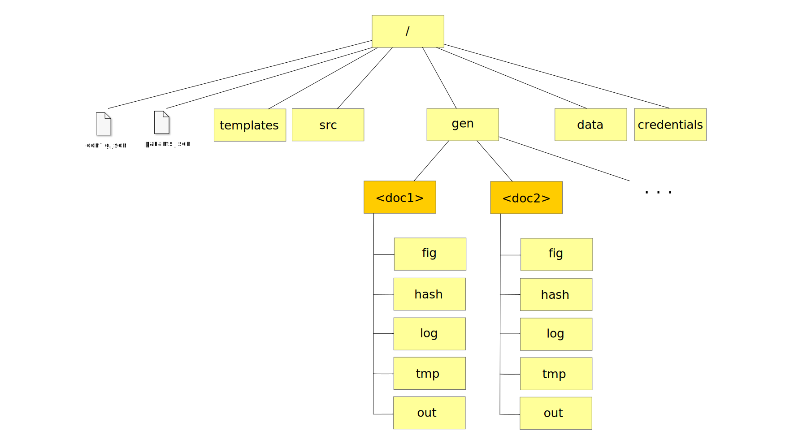

.. _`document_specification`: 

Document specification
======================

Each document specification is contained in a directory with the following content.

config.conf
-----------

This JSON file contains the document specification parameters (a more detailed list of possible 
values can be found in :ref:`document_configuration`). Before being parsed, this file is minified_, 
allowing for Javascript-style comments (i.e. //, /\*, \*/).

.. _minified: https://en.wikipedia.org/wiki/Minification_(programming)

.. _`params.conf`: 

params.conf
-----------

This library uses a dictionary as a document parameter, allowing for flexibility when defining arbitrarily complex structures as arguments for a document. To have more control over how the parameters are used some settings can be declared in this JSON file, with the allowed values defined in :ref:`parameters_specification`.

Folders
-------

The following folders are used in a document specification:

templates
*********

This folder contains the fragments template files that will be used in the template rendering stage. For example, if using the *jinja2* plugin its templates will be located here. The template names should always have a matching source file defining the data that will fill it, but in the case of constant templates a source file doesn't have to exist.

src
****

This folder contains the fragments source files that will be parsed in the metadata retrieval and the context generation stages. For each source file a template with the same name must exist in the *templates* directory.

The source files should include the fragment context-generating logic and the possibility to add metadata options, implemented in the way determined by the appropriate source parser plugin (see :ref:`source_parsers`).

data
****

This folder contains any external static files that might be needed for the document generation; images, file data sources, ...

credentials
***********

This folder contains JSON files with credentials that might be needed for any purpose, such as database access. 

Since these files will include sensitive information, this folder is not advised to be used for any critical or distributed applications. In its place it is preferable to use the credential manager (see :ref:`data_fetchers`) to store sensitive data in a more secure manner.

gen
****

This folder contains all the generated data created by this library. Inside it, each document will be in its own subfolder (named after the document parameter value). All the data inside *gen* should be able to be recreated entirely from scratch.

Inside each document subfolder, these other folders will be created:

* **fig**: Containing figures and other auxiliary data generated as part of the context generation process. These files are separated from the **tmp** files since it is assumed that they might be useful to keep around for debugging purposes.
* **hash**: Containing two kinds of files:
  * **.hash**: Files with the SHA256 hashes of the fragment source file, the document parameter, the data and the metadata. It will be used to detect if any of these four artifacts have changed between executions and skip the context generation process if the **skip_unchanged_fragments** is enabled.
  * **.ctx**: Files with the context created in the previous document generation. If the library detects the aforementioned artifacts have not been changed, the generation is skipped and the content of this file is used instead.
* **log**: Containing the log files for the document. When generating fragments in parallel, each fragment will have its own log file until the process ends and the logs will be collapsed into a single document log.
* **tmp**: Containing the temporary files that might be used in the generation process. It should be safe to delete all the files here, any file that should be preserved should go into the **fig** folder instead.
* **out**: Containing the output files, usually the document(s).